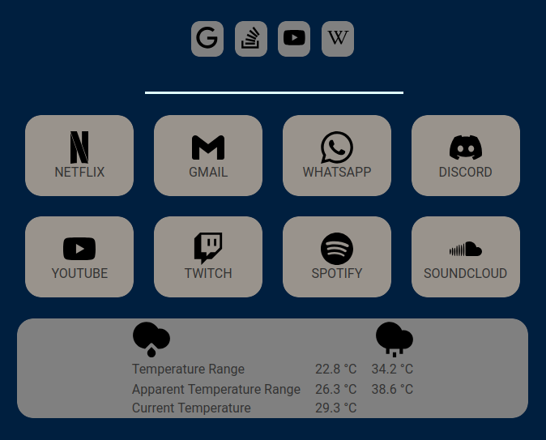

# Start Page Dashboard
Small personal start page, for home screen or new tab purposes. Currently supports:
- Searching with multiple search engines.
- Quick access to a list of sites.
- Current weather information.



## Usage
Clone the repository:

``` shell
git clone https://github.com/saniru/startpage.git
```

Install the dependencies:

``` shell
npm install
```

Load the default data files:
``` shell
npm run load-defaults
```
Edit the resulting `pages.json, search_engines.json, weather.json` files to your liking.

Run the server:
``` shell
npm run serve
```
